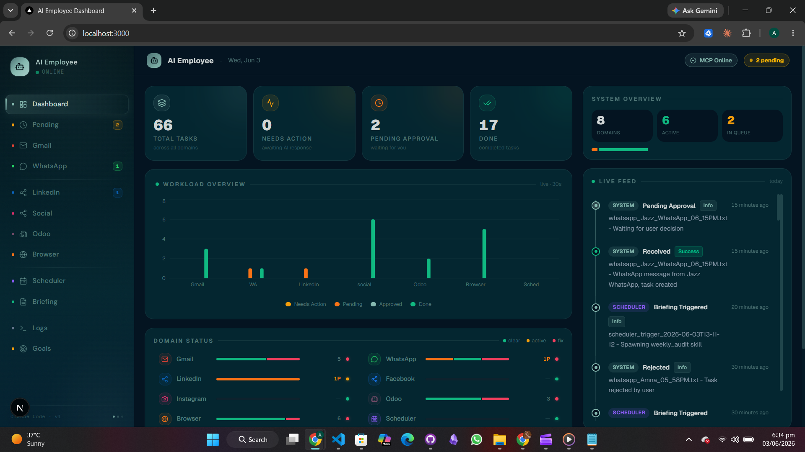

<div align="center">

# 🤖 AI Employee

**An autonomous AI system that monitors Gmail & WhatsApp, drafts plans, routes tasks through human approval, sends emails, publishes to LinkedIn, Facebook, Instagram, and manages Odoo accounting — all without manual intervention.**



[](https://python.org)
[](https://nextjs.org)
[](https://claude.ai/code)
[](LICENSE)

</div>

---

## What It Does

Your AI Employee watches your inboxes 24/7 and handles the repetitive communication work so you don't have to:

| Channel | What it does |
|---------|-------------|
| **Gmail** | Reads incoming emails, drafts replies, sends after your approval |
| **WhatsApp** | Monitors messages, plans responses, executes after approval |
| **LinkedIn** | Generates daily professional posts, publishes after approval |
| **Facebook & Instagram** | Creates platform-specific content, posts via Meta Graph API |
| **Odoo** | Reads invoices, creates draft invoices, logs transactions |
| **Browser** | Navigates websites, fills forms, takes screenshots via Playwright |

**Human-in-the-loop by design** — nothing is sent or published without your explicit approval. Every action goes through a `Pending_Approval → Approved → Done` vault pipeline.

---

## Pipeline Overview

```
Gmail / WhatsApp
      │
      ▼
  Inbox/  ──────────────►  Needs_Action/
                                │
                          AI reads & plans
                                │
                                ▼
                        Pending_Approval/
                                │
                        ┌───────┴────────┐
                        │  Human review  │
                        │   (Y / N)      │
                        └───────┬────────┘
                     ┌──────────┴──────────┐
                  Approved/            Rejected/
                     │
              Execute action
           (email / post / invoice)
                     │
                   Done/
```

---

## Tech Stack

| Layer | Technology |
|-------|-----------|
| AI / Orchestration | Claude Code (Anthropic) + Claude Sonnet |
| Backend watchers | Python 3.11 + `uv` |
| Frontend dashboard | Next.js 15 + TypeScript + Tailwind CSS |
| Email | Gmail API (OAuth2) via MCP server |
| Social media | Meta Graph API (Facebook & Instagram) |
| LinkedIn | Playwright MCP (browser automation) |
| Accounting | Odoo Community (self-hosted, JSON-RPC) |
| Protocol | MCP (Model Context Protocol) — 3 servers |

---

## Prerequisites

| Requirement | Version | Install |
|-------------|---------|---------|
| Python | 3.11+ | via [uv](https://github.com/astral-sh/uv) |
| uv | latest | `pip install uv` |
| Node.js | 18+ | [nodejs.org](https://nodejs.org) |
| Claude Code CLI | latest | `npm install -g @anthropic-ai/claude-code` |

**External services:**

| Service | Purpose | How to get |
|---------|---------|------------|
| Google Cloud | Gmail API | Enable Gmail API → download `credentials.json` |
| Meta Developer App | Facebook & Instagram | Create app → add `pages_manage_posts` + `instagram_content_publish` permissions |
| Anthropic API | Claude Code | [console.anthropic.com](https://console.anthropic.com) → `claude auth login` |
| Odoo Community | Accounting | Self-hosted on port 8069 |

---

## Quick Start

### 1. Clone & install

```powershell
git clone https://github.com/Amna-Iftikhar418/AI_Employee_Project.git
cd AI_Employee_Project
uv sync
npm install
```

### 2. Configure environment

```powershell
copy .env.example .env
# Fill in all values — see .env.example for descriptions
```

Key values to set:

```env
MCP_API_KEY=<generate: python -c "import secrets; print(secrets.token_hex(32))">
GMAIL_CREDENTIALS_PATH=credentials.json
META_PAGE_ACCESS_TOKEN=<long-lived page token from Meta>
META_PAGE_ID=<numeric page ID>
META_IG_USER_ID=<Instagram business user ID>
ODOO_URL=http://localhost:8069
ODOO_USERNAME=admin
ODOO_PASSWORD=admin
```

### 3. Authenticate Gmail (first time only)

```powershell
uv run watchers/gmail_watcher.py
```

Follow the OAuth prompt in your browser. A `token.json` is saved automatically and auto-refreshes.

### 4. Authenticate Claude Code (first time only)

```powershell
claude auth login
```

### 5. Start the AI Employee

```powershell
uv run watchers/main.py
```

This single command starts all backend components. The frontend dashboard runs separately:

```powershell
cd frontend
npm run dev
# Open http://localhost:3000
```

---

## What Starts Automatically

`uv run watchers/main.py` launches all components in parallel:

| Component | Role |
|-----------|------|
| `mcp_server.py` | Email MCP server (HTTP, port 8001) |
| `gmail_watcher.py` | Polls Gmail every 10s |
| `whatsapp_watcher.py` | Monitors WhatsApp Web |
| `filesystem_watcher.py` | Inbox → Needs_Action routing (5s) |
| `task_processor.py` | Processes tasks, triggers AI skills (5s) |
| `approved_watcher.py` | Executes approved LinkedIn/Social/Odoo tasks (5s) |
| `pending_approval_watcher.py` | Windows dialog for human approval |
| `scheduler.py` | Daily LinkedIn post at 09:00, CEO briefing Mondays 08:00 |

---

## MCP Servers

Three MCP servers power the integrations:

### Email MCP (HTTP)
```
Transport : HTTP — FastAPI + uvicorn
Port      : 8001
Purpose   : Send emails via Gmail API
Start     : uv run mcp_server.py  (auto-started by main.py)
```

### Odoo MCP (stdio)
```
Transport : stdio (MCP protocol)
Purpose   : Read/create invoices, query balances
Start     : uv --directory mcp_servers/odoo_mcp run odoo-mcp
Config    : .mcp.json → "odoo" block
```

### Social MCP (stdio)
```
Transport : stdio (MCP protocol)
Purpose   : Post to Facebook Pages and Instagram
Start     : uv --directory mcp_servers/social_mcp run social-mcp
Config    : .mcp.json → "social" block
```

---

## Vault Structure

All tasks, plans, and data live in the vault — local files, never in a database:

```
vault/AI_Employee_Vault/
├── Inbox/
│   ├── email/              ← Raw incoming emails from Gmail
│   └── whatsapp/           ← Raw incoming WhatsApp messages
├── Needs_Action/
│   ├── email/              ← Email tasks ready for AI processing
│   ├── whatsapp/           ← WhatsApp tasks ready for AI processing
│   ├── odoo/               ← Odoo tasks
│   └── social/             ← Social media tasks
├── Plans/                  ← PLAN_*.md (one per task, AI-generated)
├── Pending_Approval/       ← Drafts waiting for human Yes/No
├── Approved/               ← Human-approved, ready to execute
├── Rejected/               ← Human-rejected (archived)
├── Done/                   ← Completed and executed tasks
├── Logs/                   ← Daily logs: log_YYYY-MM-DD.md
├── Briefings/              ← Weekly CEO briefings (Mondays)
└── Dashboard.md            ← Live status overview
```

---

## Agent Skills

All AI logic lives in `.claude/skills/` and is invoked by Claude Code:

| Skill | Triggered by |
|-------|-------------|
| `gmail_handler` | `TASK_*.md` in `Needs_Action/email/` |
| `whatsapp_handler` | `TASK_*.md` in `Needs_Action/whatsapp/` |
| `generate_plan` | Any task before action |
| `send_email` | Approved email in `Approved/email/` |
| `process_approved` | Approved non-LinkedIn task |
| `linkedin_post_creator` | User request or daily scheduler (09:00) |
| `linkedin_publisher` | Approved LinkedIn post — Playwright MCP |
| `facebook_instagram_poster` | User request or `SOCIAL_POST_*.md` |
| `odoo_handler` | `TASK_odoo_*.md` in `Needs_Action/odoo/` or `Approved/odoo/` |
| `browser_handler` | `TASK_browser_*.md` in `Needs_Action/browser/` |
| `weekly_audit` | Every Monday 08:00 — generates CEO briefing |

---

## Approval Rules (Never Bypassed)

| Action | Requires file in |
|--------|-----------------|
| Send email | `Approved/email/` |
| Publish LinkedIn post | `Approved/linkedin/` |
| Post to Facebook/Instagram | `Approved/social/` |
| Odoo invoice/payment | `Approved/odoo/` |
| Browser form submission | `Approved/browser/` |

Read-only actions (Gmail reading, screenshots, Odoo reads) do **not** require approval.

---

## Troubleshooting

**"Another instance is already running"**
```powershell
Remove-Item .ai_employee.pid -ErrorAction SilentlyContinue
uv run watchers/main.py
```

**"Port 8001 is in use"** — `main.py` auto-kills it on startup. If it persists:
```powershell
netstat -ano | findstr :8001
taskkill /F /PID <PID>
```

**Gmail not picking up emails**
1. Check `token.json` exists — if missing, re-run `uv run watchers/gmail_watcher.py`
2. Check `vault/AI_Employee_Vault/Logs/log_<today>.md` for `[AuthError]`

**Facebook/Instagram posts failing**
- Meta access tokens expire after 60 days — regenerate at [developers.facebook.com](https://developers.facebook.com)

**Odoo MCP not connecting**
- Confirm Odoo is running at [http://localhost:8069](http://localhost:8069)
- Verify `.env` values: `ODOO_URL`, `ODOO_DB`, `ODOO_USERNAME`, `ODOO_PASSWORD`

**OneDrive permission errors**
```powershell
xcopy /E /I /H /Y "C:\Users\<you>\OneDrive\AI_Employee_Project" "C:\AI_Employee_Project"
```

---

## Built By

**Amna Iftikhar** — built entirely with [Claude Code](https://claude.ai/code)

> *"I built an AI employee that reads my emails, replies to WhatsApp, and posts on LinkedIn — without me lifting a finger."*

---

<div align="center">

**[Report a Bug](https://github.com/Amna-Iftikhar418/AI_Employee_Project/issues) · [Request a Feature](https://github.com/Amna-Iftikhar418/AI_Employee_Project/issues)**

</div>
